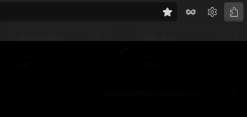

<div align="center">
  <p>
    
  </p>
  
  <h1>ConvertEx</h1>
  
  <p>Easily convert between over 200 fiat and cryptocurrencies ad-free.</p>
  <p>Pop-up toggles using the hotkey <code>Ctrl+Shift+F</code> on Windows or <code>Command+shift+F</code> on Mac</p>
  <br>
</div>

---

# Technical Highlights

* **Reactive State Management:** Uses Pinia to locally store last used currency pair and input value, alongside caching the last fetched exchange rate for instant conversion.
* **Minimalist Styling:** Leverages Pico CSS to build a lightweight and sleek UI while keeping build size at around 200 KB.
* **Efficient Algorithms:** Minimizes API latency by pre-fetching base rates and calculating cross-rates locally via triangulation, allowing for O(1) instantaneous lookups for all currency pairs without additional network requests, reducing latency and API calls.

# Browser Compatibility

This extension is compatible with the following browsers. Please note its availability on official stores.

| Browser        | Compatibility            | Store Availability               | How to Use                                                                                 |
| :------------- | :----------------------- | :------------------------------- | :------------------------------------------------------------------------------------------|
| Mozilla Firefox| ✅ Fully Supported       | ✅ Available on Firefox Add-ons | [Install from Firefox Add-ons](https://addons.mozilla.org/en-US/firefox/addon/convertex/)  |
| Google Chrome  | ✅ Fully Supported       | 🚫 Not on Web Store             | Load as [Unpacked Extension](#local-installation)                                          |
| Microsoft Edge | ✅ Fully Supported       | 🚫 Not on Edge Add-ons          | Load as [Unpacked Extension](#local-installation)                                          |
| Brave Browser  | ✅ Expected to Work      | 🚫 (Uses Chrome Web Store)      | Load as [Unpacked Extension](#local-installation)                                          |

# Local Installation

1. Download the zipped extension from [Releases](https://github.com/polyychi/ConvertEx/releases).
2. Load as unpacked extension:
    * Open your browser and navigate to `chrome://extensions` (Chrome/Brave) or `edge://extensions` (Edge).
    * Enable "Developer Mode".
    * Drag and drop the `.zip` into the extensions page.

# Building Locally

### Requirements

* [Node.js](https://nodejs.org/en/download) (v22 LTS recommended)
* [npm](https://www.npmjs.com/) (v10.x or higher)

### Install project dependencies

```sh
npm install
```

### Build script

```sh
npx vite build
```

### Loading as a browser extension

After building the application, the `dist/` folder contains all necessary files to load the extension into your browser.
